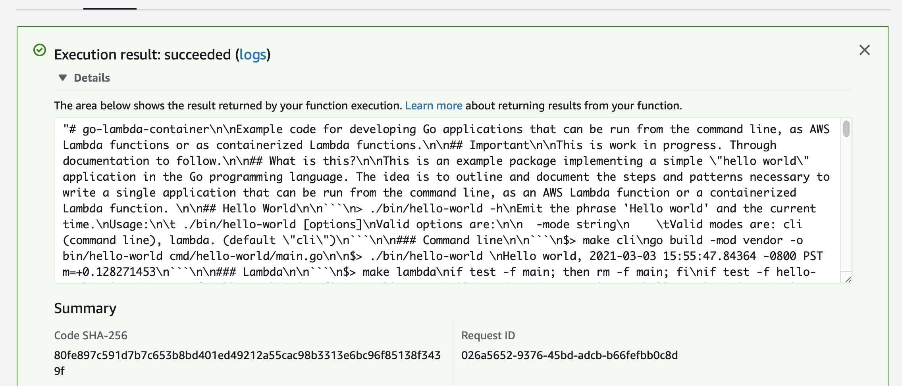

# go-lambda-container

Example code for developing Go applications that can be run from the command line, as AWS Lambda functions or as containerized Lambda functions.

## Important

This is work in progress. Through documentation to follow.

## What is this?

This is an example package implementing a simple "hello world" application in the Go programming language. The idea is to outline and document the steps and patterns necessary to write a single application that can be run from the command line, as an AWS Lambda function or a containerized Lambda function. 

## hello-world

The `hello-world` tool emits the phrase "Hello world" and the current time.

```
> ./bin/hello-world -h
Emit the phrase 'Hello world' and the current time.
Usage:
	 ./bin/hello-world [options]
Valid options are:

  -mode string
    	Valid modes are: cli (command line), lambda. (default "cli")
```

### Command line

```
$> make cli
go build -mod vendor -o bin/hello-world cmd/hello-world/main.go

$> ./bin/hello-world 
Hello world, 2021-03-03 15:55:47.84364 -0800 PST m=+0.128271453
```

### Lambda

```
$> make lambda
if test -f main; then rm -f main; fi
if test -f hello-world.zip; then rm -f hello-world.zip; fi
GOOS=linux go build -mod vendor -o main cmd/hello-world/main.go
zip hello-world.zip main
  adding: main (deflated 48%)
rm -f main
```

Create a new Lambda function, in AWS, using `hello-world.zip` as the source code. Ensure that the Lambda handler is configured to be `main`. The function itself does not need any special permissions to the default role, that AWS will create by default, is sufficient.

Ensure the following environment variables are assigned:

| Name | Value |
| --- | --- |
| SFOMUSEUM_MODE | lambda |

Create an empty test (`{}`) and run it. It should succeed with a `null` output, writing the phrase "Hello world" to the function's log file.

### Lambda (using a container image)

```
$> make docker
docker build -f Dockerfile -t hello-world .
Sending build context to Docker daemon  12.82MB

...Docker stuff happens

Successfully built 97c609afd399
Successfully tagged hello-world:latest
```

Tag and push the `hello-world` container image to an AWS ECS repository.

Create a new Lambda function, in AWS, using `hello-world` container image as the source code. The function itself does not need any special permissions to the default role, that AWS will create by default, is sufficient.

Ensure the following container image configuration values:

| Name | Value |
| --- | --- |
| CMD override | /main |

Ensure the following environment variables are assigned:

| Name | Value |
| --- | --- |
| SFOMUSEUM_MODE | lambda |

Create an empty test (`{}`) and run it. It should succeed with a `null` output, writing the phrase "Hello world" to the function's log file.

To test locally you can do:

```
$> docker run -e SFOMUSEUM_MODE=lambda -p 9000:8080 hello-world:latest /main
```

And then in another terminal:

```
$> curl -XPOST "http://localhost:9000/2015-03-31/functions/function/invocations" -d '{}'
"Hello world, 2021-03-03 23:39:42.2782989 +0000 UTC m=+0.007045701"
```

## read-file

The `read-file` tool demonstrates bundling files in your container that can be accessed by your Go application. The code uses the [GoCloud blob.Bucket](https://gocloud.dev/howto/blob/) abstraction layer for reading files, in particular the [local storage driver](https://gocloud.dev/howto/blob/#local) for access files on the local filesystem.

```
$> ./bin/hello-world -h
Emit the phrase 'Hello world' and the current time.
Usage:
	 ./bin/hello-world [options]
Valid options are:

  -mode string
    	Valid modes are: cli (command line), lambda. (default "cli")
```

### Command line

```
$> make cli
go build -mod vendor -o bin/read-file cmd/read-file/main.go
```

```
$> ./bin/read-file \
	-bucket-uri file:///usr/local/sfomuseum/go-lambda-container/ \
	README.md \
| wc -l

     155
```

### Lambda

As written this code will not work in a traditional Lambda function because there is no filesystem to read files from.

_Note: Because the code is using the [GoCloud blob.Bucket](https://gocloud.dev/howto/blob/) abstraction layer for reading files it could be made to work from another storage system like S3. You will need to update the code to load the necessary packages in order for that to work._

### Lambda (using a container image)

```
$> make docker-readfile
docker build -f Dockerfile.readfile -t read-file .
Sending build context to Docker daemon  29.68MB

...Docker stuff happens...

Step 5/11 : RUN mkdir /usr/local/example
Step 6/11 : COPY README.md /usr/local/example/README.md

...More Docker stuff happens...

Successfully tagged read-file:latest
```

Tag and push the `read-file` container image to an AWS ECS repository.

Create a new Lambda function, in AWS, using `read-file` container image as the source code. The function itself does not need any special permissions to the default role, that AWS will create by default, is sufficient.

Ensure the following container image configuration values:

| Name | Value |
| --- | --- |
| CMD override | /main |

Ensure the following environment variables are assigned:

| Name | Value |
| --- | --- |
| SFOMUSEUM_MODE | lambda |
| SFOMUSEUM_BUCKET_URI | file:///usr/local/example/ |

Create a new test like this:

```
{"path":"README.md"}
```

Then run it. You should see something like this:



For testing locally you can do this:

```
$> docker run -e SFOMUSEUM_MODE=lambda -e SFOMUSEUM_BUCKET_URI=file:///usr/local/example -p 9000:8080 read-file:latest /main
time="2021-03-04T21:48:23.104" level=info msg="exec '/main' (cwd=/go, handler=)"
```

And then this:

```
$> curl -XPOST "http://localhost:9000/2015-03-31/functions/function/invocations" -d '{"path":"README.md"}'

"# go-lambda-container\n\nExample code for developing Go applications that can be run from the command line, as AWS Lambda functions or as containerized Lambda functions.\n\n## Important\n\nThis is work in progress. Through documentation to follow.\n\n## What is this?\n\nThis is an example package implementing a simple \"hello world\" application in the Go programming language. The idea is to outline and document the steps and patterns necessary to write a single application that can be run from the command line, as an AWS Lambda function or a containerized Lambda function. \n\n## Command line\n\n```\n$\u003e make cli\ngo build -mod vendor -o bin/hello-world cmd/hello-world/main.go\n\n$\u003e ./bin/hello-world \nHello world, 2021-03-03 15:55:47.84364 -0800 PST m=+0.128271453\n```\n\n## Lambda\n\n```\n$\u003e make lambda\nif test -f main; then rm -f main; fi\nif test -f hello-world.zip; then rm -f hello-world.zip; fi\nGOOS=linux go build -mod vendor -o main cmd/hello-world/main.go\nzip hello-world.zip main\n  adding: main (deflated 48%)\nrm -f main\n```\n\nCreate a new Lambda function, in AWS, using `hello-world.zip` as the source code. Ensure that the Lambda handler is configured to be `main`. The function itself does not need any special permissions to the default role, that AWS will create by default, is sufficient.\n\nEnsure the following environment variables are assigned:\n\n| Name | Value |\n| --- | --- |\n| SFOMUSEUM_MODE | lambda |\n\nCreate an empty test (`{}`) and run it. It should succeed with a `null` output, writing the phrase \"Hello world\" to the function's log file.\n\n## Lambda (using a container image)\n\n```\n$\u003e make docker\ndocker build -f Dockerfile -t hello-world .\nSending build context to Docker daemon  12.82MB\n\n...Docker stuff happens\n\nSuccessfully built 97c609afd399\nSuccessfully tagged hello-world:latest\n```\n\nTag and push the `hello-world` container image to an AWS ECS repository.\n\nCreate a new Lambda function, in AWS, using `hello-world` container image as the source code. The function itself does not need any special permissions to the default role, that AWS will create by default, is sufficient.\n\nEnsure the following container image configuration values:\n\n| Name | Value |\n| --- | --- |\n| CMD override | /main |\n\nEnsure the following environment variables are assigned:\n\n| Name | Value |\n| --- | --- |\n| SFOMUSEUM_MODE | lambda |\n\nCreate an empty test (`{}`) and run it. It should succeed with a `null` output, writing the phrase \"Hello world\" to the function's log file.\n\nTo test locally you can do:\n\n```\n$\u003e docker run -e SFOMUSEUM_MODE=lambda -p 9000:8080 hello-world:latest /main\n```\n\nAnd then in another terminal:\n\n```\n$\u003e curl -XPOST \"http://localhost:9000/2015-03-31/functions/function/invocations\" -d '{}'\n\"Hello world, 2021-03-03 23:39:42.2782989 +0000 UTC m=+0.007045701\"\n```"
```